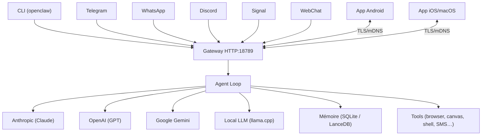

# Architecture et Décisions Techniques

## 1. Structure Globale

Monorepo pnpm workspace (TypeScript/ESM, Node.js ≥22) organisé en couches :

```
openclawIPCRAE/
├── src/              — Core gateway
│   ├── cli/          — CLI openclaw (Commander.js)
│   ├── commands/     — Commandes CLI (agent, gateway, message…)
│   ├── gateway/      — Serveur HTTP/WS, auth, boot, agent loop
│   ├── channels/     — Canaux intégrés (Telegram, Discord, Slack, Signal, iMessage, WhatsApp, Web)
│   ├── providers/    — Backends modèles IA (Anthropic, OpenAI, Gemini, GitHub Copilot…)
│   ├── plugins/      — Hooks, mémoire, outils
│   ├── canvas-host/  — Canvas interactif (A2UI)
│   ├── security/     — Rate limiting, sandbox, TLS pairing
│   └── tui/          — Interface terminal (pi-tui)
├── extensions/       — Plugins canaux optionnels (Matrix, Teams, Feishu, IRC, Zalo, voix…)
├── apps/             — Apps natives (Android/Kotlin, iOS+macOS/Swift)
├── skills/           — Skills bundlées (baseline UX)
├── ui/               — Frontend web (Lit/WebComponents)
└── docs/             — Documentation Mintlify
```

Flux de données : `Canal entrant → Gateway (auth/routing) → Agent loop (provider IA) → Réponse → Canal sortant`

## 2. Décisions de Conception (ADR)

- **ADR-001** : TypeScript/ESM choisi pour hackabilité et itération rapide — orchestration, prompts, intégrations
- **ADR-002** : Architecture plugin/extension — core lean, capacités optionnelles via npm packages
- **ADR-003** : SQLite (`memory-core`) pour mémoire locale simple ; LanceDB (`memory-lancedb`) pour mémoire vectorielle
- **ADR-004** : MCP via `mcporter` externe — découplage du runtime core, flexibilité sans bloat
- **ADR-005** : Gateway daemon (launchd/systemd user) — always-on, accessible depuis toutes les messageries
- **ADR-006** : TLS mutuellement authentifié pour le pairing Gateway ↔ apps mobiles (mDNS/Bonjour discovery)
- **ADR-007** : Fork d'OpenClaw upstream — bénéficier des contributions communautaires tout en personnalisant pour IPCRAE

## 3. Schéma de Données / API



**Ports / protocoles clés :**

- Gateway : HTTP/WS `18789` (loopback par défaut, configurable)
- Pairing apps : mDNS Bonjour + TLS mutuel
- Canal web : WebSocket temps réel

## 4. Stack technique

| Couche       | Technologie                         |
| ------------ | ----------------------------------- |
| Runtime      | Node.js ≥22, pnpm workspace         |
| Langage      | TypeScript strict (ESM)             |
| CLI          | Commander.js                        |
| HTTP/WS      | Express v5, ws                      |
| Mémoire      | SQLite (better-sqlite3), LanceDB    |
| Tests        | Vitest (unit, e2e, live, docker)    |
| Lint/Format  | Oxlint, Oxfmt                       |
| CI           | GitHub Actions, Docker              |
| Apps mobiles | Kotlin (Android), Swift (iOS/macOS) |
| Build        | tsdown, esbuild (A2UI canvas)       |
